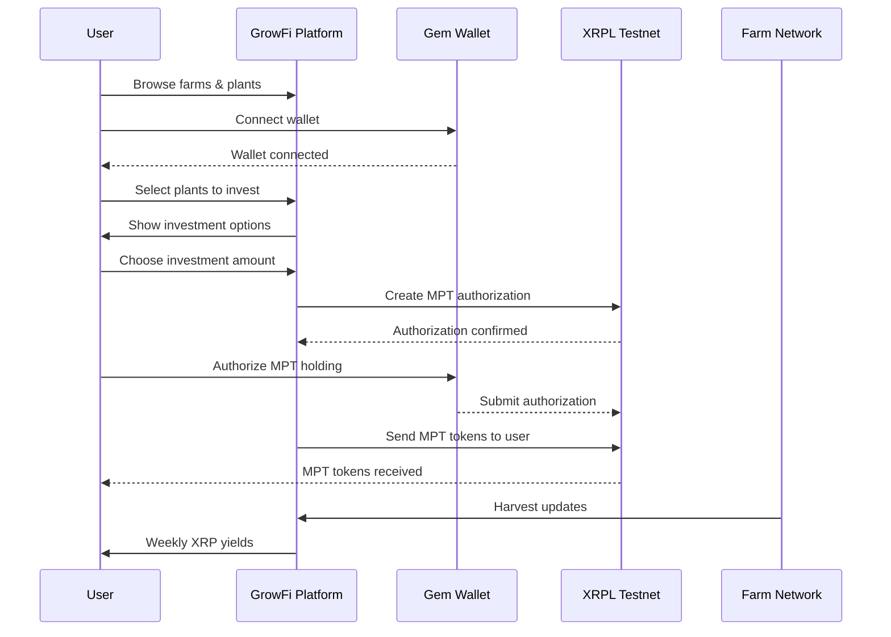

# GrowFi Platform - Sustainable Urban Farming Investment

> Co-own & co-grow sustainable urban food through fractional plant ownership powered by XRPL Multi-Purpose Tokens (MPTs)

## Quick Start

```bash
npm install
npm run dev
```

Open [http://localhost:3000](http://localhost:3000) in your browser.

## Platform Overview

GrowFi revolutionizes urban agriculture investment by enabling fractional ownership of real plants through XRPL MPT tokens. Investors earn weekly XRP yields from harvests while supporting sustainable local food production.

### Key Features

- **Fractional Plant Ownership**: Own shares of real plants starting from 10 XRP
- **Monthly XRP Yields**: Earn atleast 3-5% weekly returns from harvest sales
- **Real Farm Integration**: 5 urban farms with 500+ available plots
- **Sustainable Impact**: Track CO₂ reduction, water conservation, and food production
- **XRPL MPT Tokens**: Secure blockchain-based ownership certificates

## Platform Flow



## 🏠 Featured Farms & MPT Tokens

| Farm | Token | Symbol | Plots | XRPL Testnet Token ID |
|------|-------|--------|--------|----------------------|
| **Fresh City Farms** | FRSH | 🥬 | 150 | [FBBC02625D50DA9B36BC3F112814493FFF6F8B4EF95A710E06AA6ACF49E655CB](https://testnet.xrpl.org/transactions/8C7C33359B0CE06B24E362A951A77247CA069C8AA367303946E6E2F273EC263D) |
| **Black Creek Community** | CREEK | 🌿 | 78 | [4BFDE23483A14EF72965B0C4538BCAB637021583E14791630F9447FE5AEF9142](https://testnet.xrpl.org/transactions/DD5A5AB7FCC247C7F5FE52DC39789FAFA175509051E642961DB98A5BF733BBA8) |
| **Toronto Urban Growers** | GROW | 🌱 | 200 | [3E3AFA6F6C2A58B6145ABF8AC77EE7E43E7E7240F350B703891D99C6B8841DDA](https://testnet.xrpl.org/transactions/5E8CF190CCF12FBCE368D774D5F4C84F2F8FC2042429649AA4A7A43CDAE6F1F9) |
| **Riverdale Farm** | RIVER | 🏞️ | 95 | [72B238CCCBD4C5BBB2C2E4005A35E2C341028ACA6B03AF109E9DEAFF0407C0FE](https://testnet.xrpl.org/transactions/57DB6D8D3C1DE3808C59E88D5D3A29A6C1AC59E54F4B7C66C4AA084C39CC66F2) |
| **FoodShare Toronto** | SHARE | 🍃 | 87 | [1376534AC46D45F0AC993B7CE4CD0AAFAE3E117E2EB26A29DBBEA681A7121B94](https://testnet.xrpl.org/transactions/1042D91428F4AB81D6F0E68990A7DC50849273051B64D9F1D2F2ECCF145369D0) |

### Impact Credits Token

| Token | Symbol | Purpose | XRPL Testnet Token ID |
|-------|--------|---------|----------------------|
| **SPROUT Impact Credits** | SPROUT | Environmental & social impact tracking | [97031CA0462665BDAFCE5C70441ECC64AFA7EBF4E3CCD26473750E2398D6A78D](https://testnet.xrpl.org/transactions/D67429A293A8719D7AB092D1DFDC027ABD70457E7C741A0CB321E1E26C60FBF4) |


## Technology Stack

- **Frontend**: Next.js 16, React 19, Tailwind CSS
- **Blockchain**: XRPL (XRP Ledger) with MPT tokens
- **Wallet**: GemWallet integration
- **Backend**: Next.js API routes
- **Network**: XRPL Testnet (`wss://s.altnet.rippletest.net:51233`)

## XRPL Integration

### Issuer Wallet
- **Address**: `radxtNHYtZKC5jvF27Jj9GBi2nj4Lbht2e`
- **Network**: XRPL Testnet

### Key Features
- **MPT Authorization**: Users authorize holding farm tokens
- **Instant Transfers**: Direct MPT token distribution
- **Transaction Transparency**: All transactions viewable on XRPL explorer

### Core Features Implemented
✅ Multi-farm marketplace with 5 active farms
✅ XRPL MPT token creation and management
✅ GemWallet integration for seamless payments
✅ Real-time transaction processing
✅ Plant selection and plot management
✅ Impact tracking and sustainability metrics


## Project Structure

```
growfi-platform-mvp/
├── app/                    # Next.js app router
│   ├── api/mpt/           # MPT token API endpoints
│   ├── farms/             # Farm listing and details
│   ├── marketplace/       # Plant marketplace
│   └── portfolio/         # User investment tracking
├── components/            # React components
├── lib/                   # Utility functions and context
├── scripts/               # XRPL token creation scripts
└── contexts/              # React context providers
```

## 🏆 Impact & Vision

GrowFi bridges the gap between sustainable agriculture and accessible investment, creating a new asset class backed by real food production. By leveraging XRPL's efficient MPT technology, we're making urban farming investment simple, transparent, and impactful.
